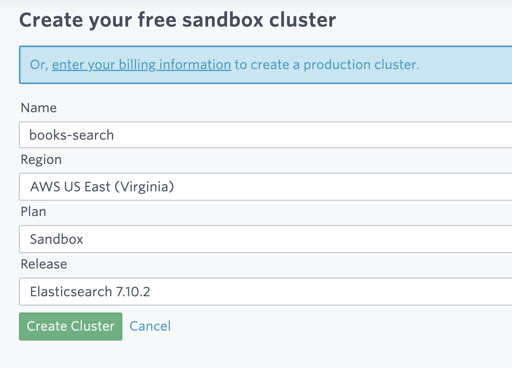
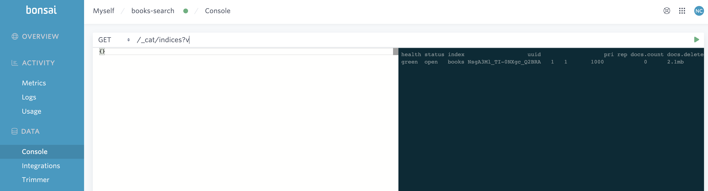
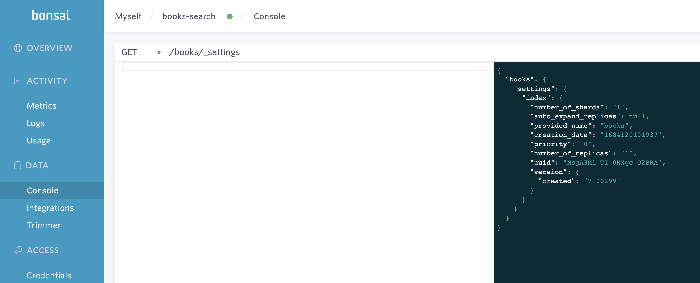
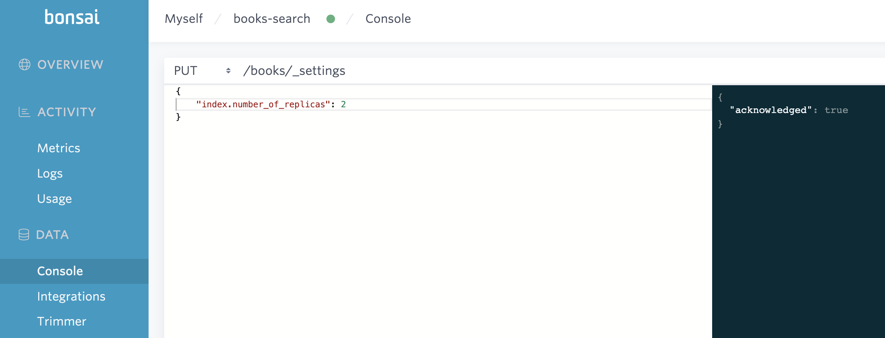
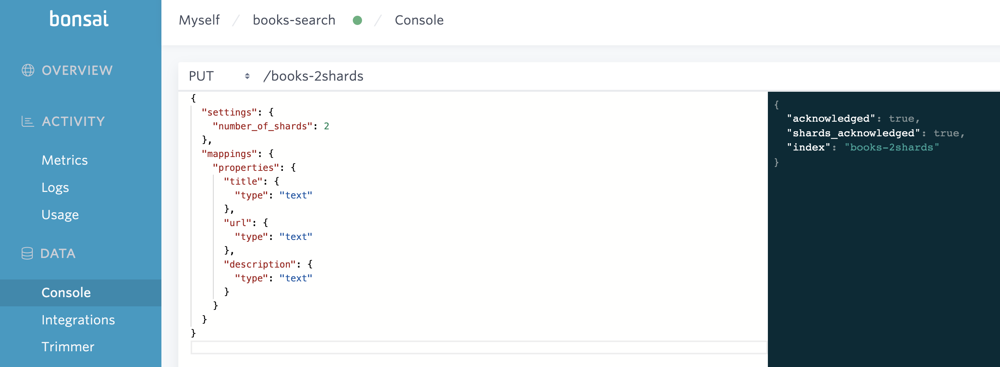
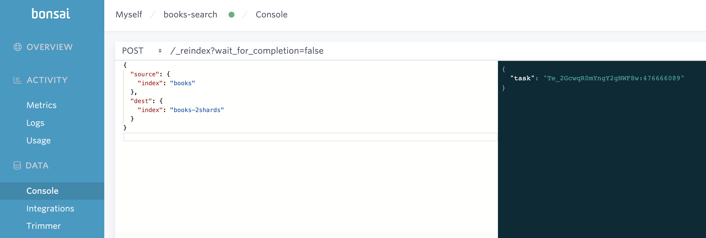

# search-go - Example search application in Go

Our goal is to build a sample application in Go that uses Elasticsearch 7.10.2. For our data, we'll use the [Goodreads books dataset](https://sites.google.com/eng.ucsd.edu/ucsdbookgraph/home)[^1].

For reference, I'm using Go version 1.20.2. We plan to make two command line applications `load-books` and `search-books` to interact with the dataset and our Elasticsearch cluster.

## Set up a cluster on bonsai.io

Sign up for an account on bonsai.io to create a hosted Elasticsearch cluster. Navigate to https://app.bonsai.io/clusters/first_cluster to create your first cluster to create an Elasticsearch 7.10.2 cluster named "books-search".



Your cluster will get provisioned in AWS shortly. Once it's complete,

## Initializing the project

Let's start an application from scratch

```bash
go mod init github.com/nickcanz/search-go

mkdir -p cmd/load-books
touch cmd/load-books/main.go
```

Let's populate `cmd/load-books/main.go` with the following code:

```go
package main

import "fmt"

func main() {
	fmt.Println("Hello from load-books")
}
```

Let's build our project and create the `load-books` executeable that we can run.

```bash
go build ./cmd/load-books
./load-books
Hello from load-books
```

## Connecting to Elasticsearch via the go-elasticsearch library

We're now ready to connect to our Elasticsearch cluster. We need three pieces of information: the url, the access key, and the secret key.

We can get all of this info from `Credentials` page of our cluster. We don't want to put this information directly into our code, so let's put the information into environment variables via a `.env` file that we can load in our application using an open source library [github.com/joho/godotenv](https://github.com/joho/godotenv).

```bash
ES_URL=<base url>
ES_USER=<access key>
ES_PASSWORD=<access secret>
```

With the `.env` file populated, we can now directly connect to our Elasticsearch cluster from code using the official [go-elasticsearch](https://github.com/elastic/go-elasticsearch/tree/v7.10.0) library, making sure to use `v7.10.0` to match up with the version of Elasticsearch we're using.


Let's modify `cmd/load-books/main.go` so that it looks like below.

```go
package main

import (
	"fmt"
	"log"
	"os"

	elasticsearch7 "github.com/elastic/go-elasticsearch/v7"
	"github.com/joho/godotenv" // A helper library to load the .env file
)

func main() {
	fmt.Println("Hello from load-books")

	err := godotenv.Load()
	if err != nil {
		log.Fatal("Error loading .env file")
	}

	cfg := elasticsearch7.Config{
		Addresses: []string{
			os.Getenv("ES_URL"),
		},
		Username: os.Getenv("ES_USER"),
		Password: os.Getenv("ES_PASSWORD"),
	}

	client, err := elasticsearch7.NewClient(cfg)
	if err != nil {
		log.Fatal(err)
	}

	response, err := client.Info()
	if err != nil {
		log.Fatal(err)
	}

	log.Printf("Cluster response: %s", response)
}
```

We can pull in our dependencies by running `go mod tidy`. This command makes sure any references in our code is included in the `go.mod` file, [from the official Go documentation](https://go.dev/ref/mod#go-mod-tidy).

In order to connect to our `v7.10` Elasticsearch cluster, we also need to use the `7.10` version of `go-elasticsearch`. Let's modify our `go.mod` file to reflect this

```go
module github.com/nickcanz/search-go

go 1.20

require (
	github.com/elastic/go-elasticsearch/v7 v7.10.0
	github.com/joho/godotenv v1.5.1
)
```

And run `go mod tidy` again.

Now we can build our application and see the output:

```bash
go build ./cmd/load-books
./load-books
Hello from load-books
2023/03/21 22:32:17 Cluster response: [200 OK] {
  "name" : "node-name",
  "cluster_name" : "elasticsearch",
  "cluster_uuid" : "<uuid>",
  "version" : {
    "number" : "7.10.2",
    "build_flavor" : "oss",
    "build_type" : "tar",
    "build_hash" : "747e1cc71def077253878a59143c1f785afa92b9",
    "build_date" : "2021-01-13T00:42:12.435326Z",
    "build_snapshot" : false,
    "lucene_version" : "8.7.0",
    "minimum_wire_compatibility_version" : "6.8.0",
    "minimum_index_compatibility_version" : "6.0.0-beta1"
  },
  "tagline" : "You Know, for Search"
}
```

We've successfully connected to our live cluster running on bonsai.io!

## Loading the dataset

Let's start to write some data! We download the [goodreads_books.json.gz](https://sites.google.com/eng.ucsd.edu/ucsdbookgraph/home) to the root of our project. Let's `gunzip goodreads_books.json.gz` to uncompress the file. The file consists of JSON blobs containing information about a book separated by a new line. The full file is 8.6 gigabytes! Let's cut that down a bit by using the first 1,000 lines

```bash
head -n1000 goodreads_books.json > goodreads_books.1000.json
```

Let's model our data using the following struct:

```go
type Book struct {
	Title       string `json:"title"`
	Url         string `json:"url"`
	Description string `json:"description"`
}
```

This will match up to the index we make with the following settings and mappings:

```
indexName := "books"
indexBody := `
{
  "settings": {
    "number_of_shards": 1
  },
  "mappings": {
    "properties": {
      "title": {
        "type": "text"
      },
      "url": {
        "type": "text"
      },
      "description": {
        "type": "text"
      }
    }
  }
}`
```

We can build this up by reading the file and using the [BulkIndexer](https://pkg.go.dev/github.com/elastic/go-elasticsearch/v7@v7.10.0/esutil#BulkIndexer) available in the `esutil` package of `go-elasticsearch`.

```go
package main

import (
	"bufio"
	"bytes"
	"context"
	"encoding/json"
	"fmt"
	"io"
	"log"
	"os"
	"strings"

	elasticsearch7 "github.com/elastic/go-elasticsearch/v7"
	"github.com/elastic/go-elasticsearch/v7/esutil"
	"github.com/joho/godotenv"
)

type Book struct {
	Title       string `json:"title"`
	Url         string `json:"url"`
	Description string `json:"description"`
}

func main() {
	fmt.Println("Hello from load-books")

	err := godotenv.Load()
	if err != nil {
		log.Fatal("Error loading .env file")
	}

	cfg := elasticsearch7.Config{
		Addresses: []string{
			os.Getenv("ES_URL"),
		},
		Username: os.Getenv("ES_USER"),
		Password: os.Getenv("ES_PASSWORD"),
	}

	client, err := elasticsearch7.NewClient(cfg)
	if err != nil {
		log.Fatal(err)
	}

	indexName := "books"
	indexBody := `
	{
	  "settings": {
	    "number_of_shards": 1
	  },
	  "mappings": {
	    "properties": {
	      "title": {
	        "type": "text"
	      },
	      "url": {
	        "type": "text"
	      },
	      "description": {
	        "type": "text"
	      }
	    }
	  }
	}`
	_, err = client.Indices.Create(
		indexName,
		client.Indices.Create.WithBody(strings.NewReader(indexBody)),
	)
	if err != nil {
		log.Fatal(err)
	}

	bulkIndexer, err := esutil.NewBulkIndexer(esutil.BulkIndexerConfig{
		Index:      indexName,
		NumWorkers: 1,
		Client:     client,
		ErrorTrace: true,
		OnError: func(ctx context.Context, err error) {
			log.Fatalf("bulkindexer OnError %#v", err)
		},
	})
	if err != nil {
		log.Fatal(err)
	}

	file, err := os.Open("goodreads_books.1000.json")
	if err != nil {
		log.Fatal(err)
	}
	defer file.Close()

	reader := bufio.NewReader(file)

	for {
		readBytes, err := reader.ReadBytes('\n')
		if err != nil {
			if err == io.EOF {
				break
			}

			log.Fatalf("error reading readBytes: %v", err)
			return
		}

		var book Book
		err = json.Unmarshal(readBytes, &book)
		if err != nil {
			log.Fatalf("error unmarshalling json: %v", err)
			return
		}

		documentBytes, err := json.Marshal(book)
		if err != nil {
			log.Fatalf("error marshalling json: %v", err)
			return
		}

		err = bulkIndexer.Add(
			context.Background(),
			esutil.BulkIndexerItem{
				Action: "index",
				Body:   bytes.NewReader(documentBytes),
				// OnFailure is called for each failed operation
				OnFailure: func(ctx context.Context, item esutil.BulkIndexerItem, res esutil.BulkIndexerResponseItem, err error) {
					if err != nil {
						log.Printf("ERROR: %s", err)
					} else {
						log.Printf("ERROR: %s: %s", res.Error.Type, res.Error.Reason)
					}
				},
			})

		if err != nil {
			log.Fatalf("error adding item to bulk indexer: %v", err)
			return
		}
	}
	if err := bulkIndexer.Close(context.Background()); err != nil {
		log.Fatalf("Unexpected error: %s", err)
	}
}
```

After building the project and running it again, we can verify all the documents are there. Looking at the Console page of our cluster, we can run `GET /_cat/indices?v`

```
health status index                   uuid pri rep docs.count docs.deleted store.size pri.store.size
green  open   books hB1w4JFFRYuFIxsFhzlV5Q   1   1       1000            0      2.1mb            1mb
```

And we see 1,000 documents in the index!



## Searching the index

Now let's make a small program to search our index. We'll make a new directory to contain this program.

```bash
mkdir -p cmd/search-books
touch cmd/search-books/main.go
```

Let's start this program with an example of how we can take user input. The contents of `cmd/search-books/main.go` will look like this:

```go
package main

import (
	"flag"
	"fmt"
	"log"
)

func main() {
	queryPtr := flag.String("query", "", "Query to search for")
	flag.Parse()

	if *queryPtr == "" {
		log.Fatalf("No query provided for -query parameter")
	}

	fmt.Printf("Searching books for: %s\n", *queryPtr)
}
```

We can build and run our small program.

```bash
go build ./cmd/search-books

# Pass our search term using the -query flag
./search-books -query fantasy
Searching books for: fantasy

# Test the error case if we don't use -query
./search-books
2023/04/04 11:23:27 No query provided for -query parameter

# Use quotes to pass a multi word query
./search-books  -query "science fiction"
Searching books for: science fiction
```

Now that we have a value we can search for, let's configure an Elasticsearch client and search.

```go
package main

import (
	"encoding/json"
	"flag"
	"fmt"
	"log"
	"os"
	"strings"

	elasticsearch7 "github.com/elastic/go-elasticsearch/v7"
	"github.com/joho/godotenv"
)

type Book struct {
	Title       string `json:"title"`
	Url         string `json:"url"`
	Description string `json:"description"`
}

type BookSearchResponse struct {
	Took float64 `json:"took"`
	Hits struct {
		Hits []struct {
			Book  Book    `json:"_source"`
			Score float64 `json:"_score"`
		} `json:"hits"`
	} `json:"hits"`
}

func main() {
	queryPtr := flag.String("query", "", "Query to search for")
	flag.Parse()
	if *queryPtr == "" {
		log.Fatalf("No query provided for -query parameter")
	}

	fmt.Printf("Searching books for: %s\n", *queryPtr)

	err := godotenv.Load()
	if err != nil {
		log.Fatal("Error loading .env file")
	}

	cfg := elasticsearch7.Config{
		Addresses: []string{
			os.Getenv("ES_URL"),
		},
		Username: os.Getenv("ES_USER"),
		Password: os.Getenv("ES_PASSWORD"),
	}

	client, err := elasticsearch7.NewClient(cfg)
	if err != nil {
		log.Fatal(err)
	}
	query := fmt.Sprintf(` {
	   "query": {
	   	"multi_match":{
		  "query":"%s",
		  "fields": [ "title", "url", "description" ]
		}
	   },
	   "size": 10
	}`, *queryPtr)
	resp, err := client.Search(
		client.Search.WithIndex("books"),
		client.Search.WithBody(strings.NewReader(query)))
	if err != nil {
		log.Fatal(err)
	}
	defer resp.Body.Close()

	if resp.IsError() {
		log.Fatalf("Error querying, status: %s, response body: %s", resp.Status(), resp.String())
	}

	var bookSearchResponse BookSearchResponse

	err = json.NewDecoder(resp.Body).Decode(&bookSearchResponse)
	if err != nil {
		log.Fatal(err)
	}

	for _, bookHit := range bookSearchResponse.Hits.Hits {
		fmt.Printf("%s, %s with score of %f\n", bookHit.Book.Title, bookHit.Book.Url, bookHit.Score)
	}
}
```

Let's go over what we added. First, two structs to organize our data. We have our original `Book` struct that we used while indexing data and a `BookSearchResponse` struct. This struct matches the shape of JSON that is returned when we search Elasticsearch.

```go
type Book struct {
	Title       string `json:"title"`
	Url         string `json:"url"`
	Description string `json:"description"`
}

type BookSearchResponse struct {
	Took float64 `json:"took"`
	Hits struct {
		Hits []struct {
			Book  Book    `json:"_source"`
			Score float64 `json:"_score"`
		} `json:"hits"`
	} `json:"hits"`
}
```

Within the `main` function, we're going to use `godotenv` to load up our configuration into environment variables.

```go
err := godotenv.Load()
if err != nil {
	log.Fatal("Error loading .env file")
}
```

With our configuration loaded into env variables, we can configure our Elasticsearch client.

```go
cfg := elasticsearch7.Config{
	Addresses: []string{
		os.Getenv("ES_URL"),
	},
	Username: os.Getenv("ES_USER"),
	Password: os.Getenv("ES_PASSWORD"),
}

client, err := elasticsearch7.NewClient(cfg)
if err != nil {
	log.Fatal(err)
}
```

With our search value loaded into the variable `*queryPtr`, we can make an Elasticsearch query using a [multi match query](https://www.elastic.co/guide/en/elasticsearch/reference/7.17/query-dsl-multi-match-query.html) on the title, url, and description fields that we indexed.

```go
query := fmt.Sprintf(` {
   "query": {
   	"multi_match":{
	  "query":"%s",
	  "fields": [ "title", "url", "description" ]
	}
   },
   "size": 10
}`, *queryPtr)
```

Using our Elasticsearch client, we send the query to Elasticsearch agains the `books` index.

```go
resp, err := client.Search(
	client.Search.WithIndex("books"),
	client.Search.WithBody(strings.NewReader(query)))
```

Now we can load the body of the response into the `BookSearchResponse` struct and read and output the results of the search.

```go
var bookSearchResponse BookSearchResponse

err = json.NewDecoder(resp.Body).Decode(&bookSearchResponse)
if err != nil {
	log.Fatal(err)
}

for _, bookHit := range bookSearchResponse.Hits.Hits {
	fmt.Printf("%s, %s with score of %f\n", bookHit.Book.Title, bookHit.Book.Url, bookHit.Score)
}
```

Running the search and looking for `dogs` we get the following results:

```
./search-books -query dogs
Searching books for: dogs
Dogs Don't Bite When a Growl Will Do: What Your Dog Can Teach You About Living a Happy Life, https://www.goodreads.com/book/show/38563.Dogs_Don_t_Bite_When_a_Growl_Will_Do with score of 8.593256
Dog Heaven, https://www.goodreads.com/book/show/89378.Dog_Heaven with score of 5.433107
One Cold Night (ARe Fearless #3), https://www.goodreads.com/book/show/30821261-one-cold-night with score of 4.815971
A Nun Walks into a Bar (Nun-Fiction #1), https://www.goodreads.com/book/show/34507785-a-nun-walks-into-a-bar with score of 4.606666
Home and Heart, https://www.goodreads.com/book/show/19407047-home-and-heart with score of 4.414797
```

## Tips on maintance and updating an index

If our books application is a success and keeps growing, there might be some things that we want to change about the index structure. Let's go over some changes that can be done dynamically and some that will need a new index.

### Dynamic index changes

[There are a large number of index settings that be updated live via an API](https://www.elastic.co/guide/en/elasticsearch/reference/7.10/indices-update-settings.html#update-index-settings-api-example). One of those is the number of _replica_ shards an index has. Increasing the number of replica shards will increase the amount of work your cluster does while writing documents, but will increase your redundancy against node failures and help spread out your write load. Our `books` index was created with the default 1 replica shard. Let's increase it to 2 replica shards.

Let's use the bonsai.io console to first `GET` the index settings from the URL `/books/_settings`

```json
{
  "books": {
    "settings": {
      "index": {
        "number_of_shards": "1",
        "auto_expand_replicas": null,
        "provided_name": "books",
        "creation_date": "1684120101937",
        "priority": "0",
        "number_of_replicas": "1",
        "uuid": "NsgA3Ml_TI-0NXgc_Q2BRA",
        "version": {
          "created": "7100299"
        }
      }
    }
  }
}
```



We can issue a `PUT` request to the index to update the `number_of_replicas` setting.

For our request body to `PUT /books/_settings`

```json
{
  "index.number_of_replicas": 2
}
```

The reponse is: 

```json
{
  "acknowledged": true
}
```



And we can issue another `GET` request to the settings page to show the updated setting:

```json
{
  "books": {
    "settings": {
      "index": {
        "number_of_shards": "1",
        "auto_expand_replicas": null,
        "provided_name": "books",
        "creation_date": "1684120101937",
        "priority": "0",
        "number_of_replicas": "2",
        "uuid": "NsgA3Ml_TI-0NXgc_Q2BRA",
        "version": {
          "created": "7100299"
        }
      }
    }
  }
}
```


### Re-creating the index

But not all settings are dynamic. For example, the `number_of_shards` setting has to be chosen at index creation time and can't be updated. Elastic recommends [shards be between 10 and 50 gigabytes in size](https://www.elastic.co/guide/en/elasticsearch/reference/7.10/size-your-shards.html#shard-size-recommendation). As you add more data to your index and approach these limits, you will want to re-create your index with more shards.

An easy way to do this within Elasticsearch is to use the [reindex API](https://www.elastic.co/guide/en/elasticsearch/reference/7.10/docs-reindex.html).

Let's first create an index with an updated shard count that we want to use.

```
PUT /books-2shards
{
  "settings": {
    "number_of_shards": 2
  },
  "mappings": {
    "properties": {
      "title": {
        "type": "text"
      },
      "url": {
        "type": "text"
      },
      "description": {
        "type": "text"
      }
    }
  }
}
```



This new index has 2 shards instead of 1 that our books index has, but has all of the same mappings.

By looking at the shard information via `GET /_cat/shards?v`, we see our books index has 1000 documents in the 1 primary and replica shards. Our books-2shards index has 2 primary and 2 replica shards, but zero documents in them yet.

```
index         shard prirep state   docs store ip            node
books         0     p      STARTED 1000   1mb 172.31.83.32  ip-172-31-83-32
books         0     r      STARTED 1000   1mb 172.31.18.222 ip-172-31-18-222
books-2shards 1     r      STARTED    0  208b 172.31.83.32  ip-172-31-83-32
books-2shards 1     p      STARTED    0  208b 172.31.18.222 ip-172-31-18-222
books-2shards 0     r      STARTED    0  208b 172.31.44.58  ip-172-31-44-58
books-2shards 0     p      STARTED    0  208b 172.31.83.32  ip-172-31-83-32
```

Using the [reindex API](https://www.elastic.co/guide/en/elasticsearch/reference/7.10/docs-reindex.html), we can move all of the data from books to books-2shards.

```
POST /_reindex?wait_for_completion=false
{
  "source": {
    "index": "books"
  },
  "dest": {
    "index": "books-2shards"
  }
}
```



After a short period of time, we can check the shard stats again.

```
GET /_cat/shards?v
index         shard prirep state   docs   store ip            node
books         0     p      STARTED 1000     1mb 172.31.83.32  ip-172-31-83-32
books         0     r      STARTED 1000     1mb 172.31.18.222 ip-172-31-18-222
books-2shards 1     r      STARTED  483 561.1kb 172.31.83.32  ip-172-31-83-32
books-2shards 1     p      STARTED  483 561.1kb 172.31.18.222 ip-172-31-18-222
books-2shards 0     r      STARTED  517 575.8kb 172.31.44.58  ip-172-31-44-58
books-2shards 0     p      STARTED  517 575.8kb 172.31.83.32  ip-172-31-83-32
```

We see the 1000 documents in the books index got reindexed into the books-2shards index. 517 documents to shards 0 and 483 documents to shards 1. Using the reindex API is a great way to make a new index to increase the shard count **and** copy over all of your existing data as well.


## References

[^1]:
* Mengting Wan, Julian McAuley, ["Item Recommendation on Monotonic Behavior Chains"](https://github.com/MengtingWan/mengtingwan.github.io/raw/master/paper/recsys18_mwan.pdf), in RecSys'18.  [[bibtex]](https://dblp.uni-trier.de/rec/conf/recsys/WanM18.html?view=bibtex)
* Mengting Wan, Rishabh Misra, Ndapa Nakashole, Julian McAuley, ["Fine-Grained Spoiler Detection from Large-Scale Review Corpora"](https://aclanthology.org/P19-1248), in ACL'19. [[bibtex]](https://dblp.uni-trier.de/rec/conf/acl/WanMNM19.html?view=bibtex)
